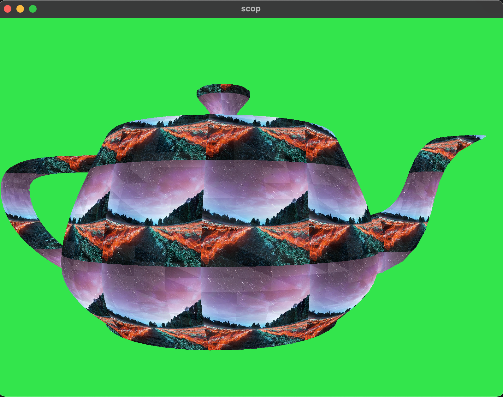
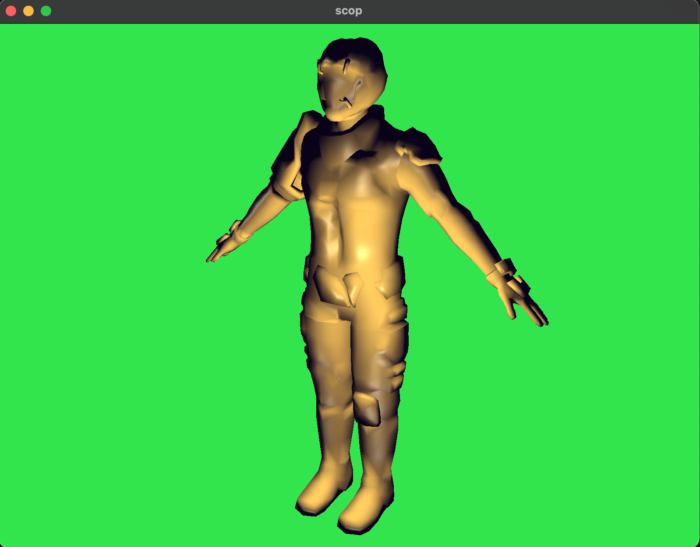
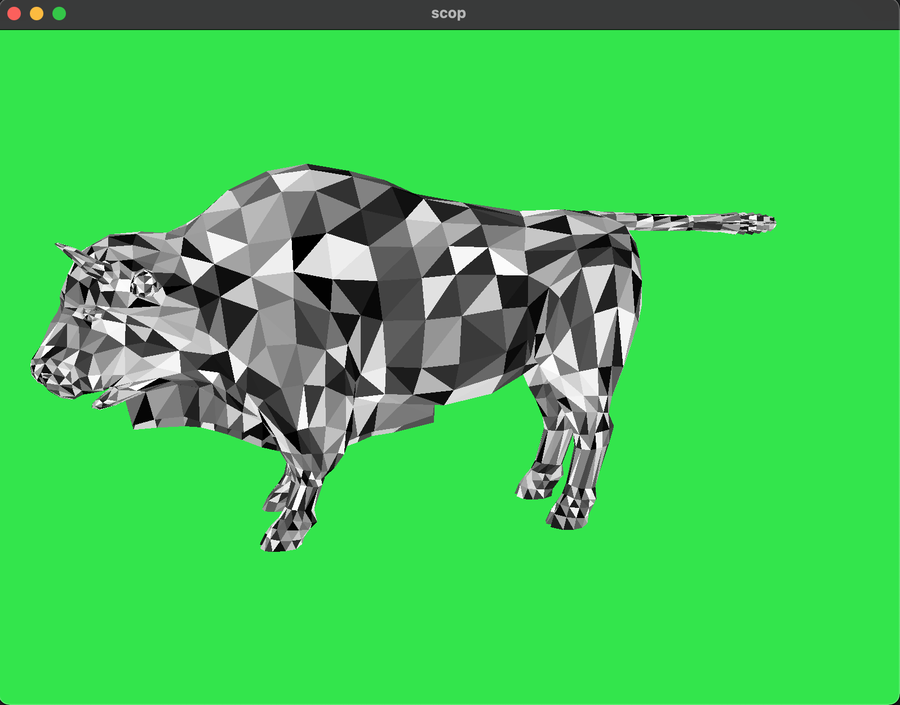

## SCOP

### Render .obj file with OpenGL

Project from (42 School)[https://en.wikipedia.org/wiki/42_(school)].

(Subject) [https://github.com/fpetras/42-subjects/blob/master/scop.en.pdf]


With texture:

With shadows:

Only polygons:



# Compilation and run
Tested only on MacOS!
```
make
./scop [path_to_obj_file]
```


# Keybord control

Mouse - for camera moving 

W, A, S, D - For move

Up and Down - activate/deactivate texture 

